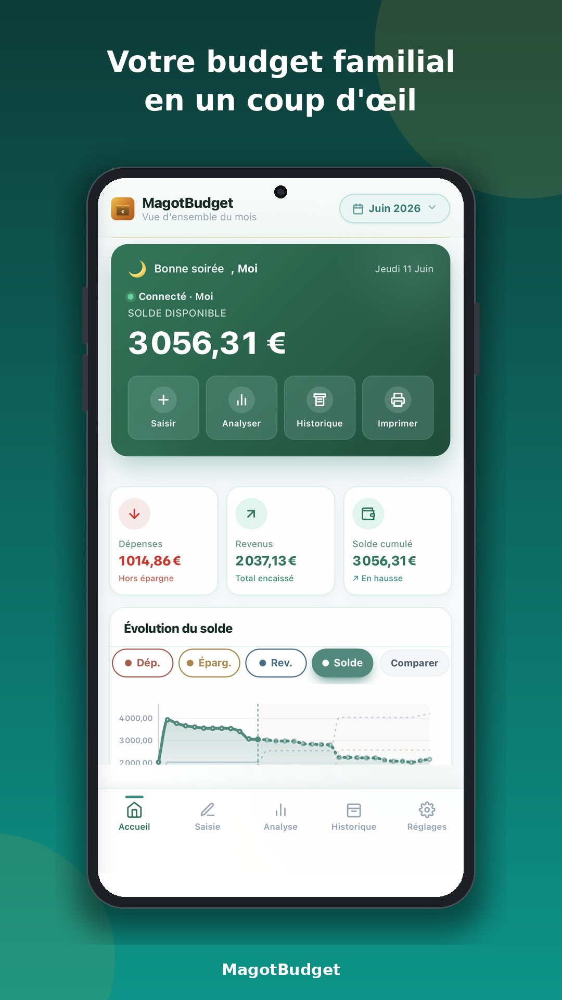
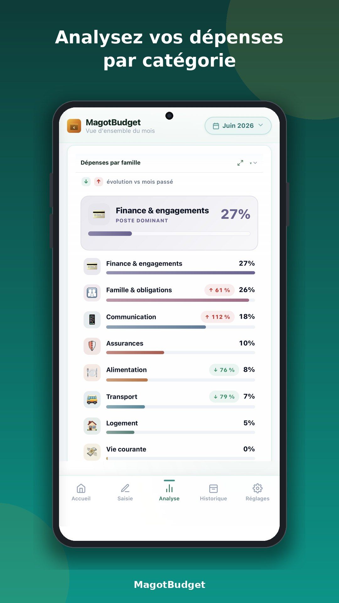
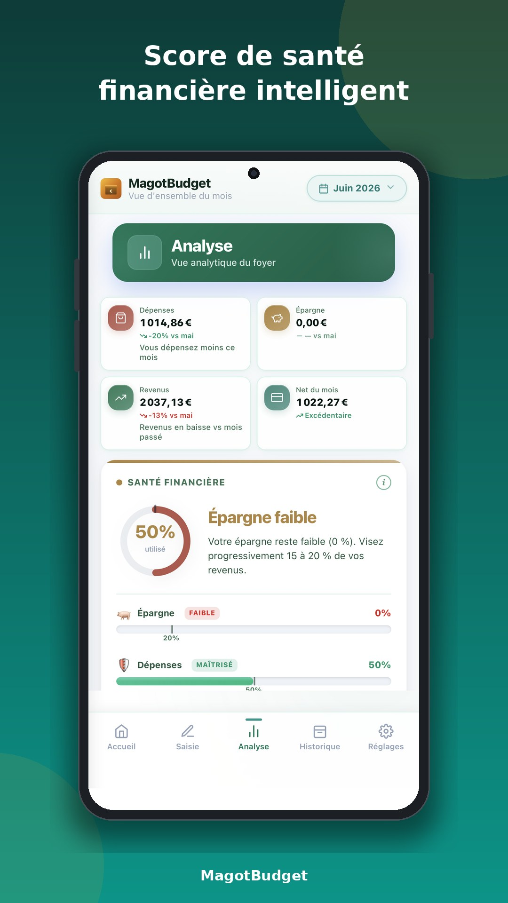

 

Votre budget familial, privé et hors-ligne — dans une seule page web.**

-----

## ✨ Aperçu

**MagotBudget** est une application de gestion de budget *privacy-first* : vos données restent **chiffrées sur votre appareil**, l’app fonctionne **hors-ligne** (PWA installable), et elle lit automatiquement vos **tickets de caisse** et **relevés bancaires**.

Aucun compte obligatoire, aucune publicité, aucun pistage. Juste votre argent, sur votre téléphone.

> **Version actuelle : `v216`** · Application web autonome — un seul fichier `index.html`.
> *(Pensez à mettre à jour ce numéro et le badge à chaque publication.)*

-----

## 📸 Captures d’écran

<table>
  <tr>
    <td align="center"> <b>Tableau de bord</b></td>
    <td align="center"> <b>Dépenses par catégorie</b></td>
    <td align="center"> <b>Score de santé financière</b></td>
  </tr>
</table>

