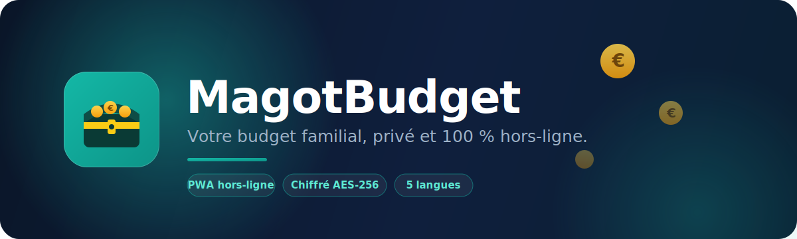

 

**Votre budget familial, privé et hors-ligne — dans une seule page web.**

-----

## ✨ Aperçu

**MagotBudget** est une application de gestion de budget *privacy-first* : vos données restent **chiffrées sur votre appareil**, l’app fonctionne **hors-ligne** (PWA installable), et elle lit automatiquement vos **tickets de caisse** et **relevés bancaires**.

Aucun compte obligatoire, aucune publicité, aucun pistage. Juste votre argent, sur votre téléphone.

> **Version actuelle : `v216`** · Application web autonome — un seul fichier `index.html`.
> *(Pensez à mettre à jour ce numéro et le badge à chaque publication.)*

-----

## 📸 Captures d’écran

<table>
  <tr>
    <td align="center"> <b>Tableau de bord</b></td>
    <td align="center"> <b>Dépenses par catégorie</b></td>
    <td align="center"> <b>Score de santé financière</b></td>
  </tr>
</table>

-----

## 🚀 Fonctionnalités

|                               |                                                                                                                                                  |
|-------------------------------|--------------------------------------------------------------------------------------------------------------------------------------------------|
|💸 **Suivi complet**            |Dépenses, revenus et épargne par catégories et sous-catégories.                                                                                   |
|🏦 **Lecture de relevés**       |Import PDF / CSV / OFX, détection auto des colonnes Débit/Crédit, montants et dates — multi-banques (Société Générale, Crédit Agricole…).         |
|🧾 **Scan de tickets**          |OCR photo ou PDF : magasin, date et **montant payé** (réductions déduites) détectés automatiquement, répartition possible en plusieurs catégories.|
|📊 **Tableau de bord**          |Solde disponible, évolution, **santé financière** notée /100, prévisions du mois.                                                                 |
|👨‍👩‍👧 **Synchronisation famille**  |Partage en temps réel entre les membres du foyer *(optionnel)*.                                                                                   |
|🎯 **Objectifs & convertisseur**|Objectifs d’épargne, convertisseur de devises intégré.                                                                                            |
|📤 **Exports**                  |Excel et PDF pour archiver ou partager.                                                                                                           |
|🌍 **5 langues**                |Français, English, Español, Italiano, Deutsch.                                                                                                    |
|📴 **100 % hors-ligne**         |Une fois installée, fonctionne sans connexion.                                                                                                    |

-----

## 🔒 Confidentialité & sécurité

> 🛡️ **Vos données ne quittent pas votre appareil.**
> 
> - Chiffrement **AES-256-GCM** (activé par défaut sur l’app native, via Android Keystore / iOS Keychain).
> - Déverrouillage optionnel par **code** ou **Face ID**.
> - Sauvegardes chiffrées par mot de passe (**PBKDF2, 600 000 itérations**).
> - **Aucune publicité, aucun traçage publicitaire.** La synchronisation famille est *optionnelle* et anonyme.

-----

## 🧩 Architecture

- **Un seul fichier** HTML / CSS / **JavaScript pur** (vanilla, sans framework).
- **PWA** : Service Worker, stockage local `IndexedDB`, manifeste dynamique.
- **App Android native** via **Capacitor** (version iOS en préparation).
- **OCR** : Tesseract.js (standard) + Google Vision (haute précision).
- **Synchronisation** *(optionnelle)* : Firebase (authentification anonyme + Firestore).

-----

## 📲 Installation

**Sur iPhone / iPad (Safari)**

1. Ouvrez l’application web.
1. Touchez **Partager** → **Sur l’écran d’accueil**.

**Sur Android (Chrome)**

1. Ouvrez l’application web.
1. Menu **⋮** → **Installer l’application**.

> 💡 Une fois ajoutée à l’écran d’accueil, MagotBudget s’ouvre en plein écran et fonctionne hors-ligne.

-----

## 🌍 Langues

🇫🇷 Français · 🇬🇧 English · 🇪🇸 Español · 🇮🇹 Italiano · 🇩🇪 Deutsch

-----

🗺️ <b>Feuille de route</b>

- [ ] Publication App Store (iOS natif)
- [ ] Notifications push (écran verrouillé)
- [ ] Widgets de solde
- [ ] Catégories personnalisables avancées

-----

**MagotBudget** — *gestion économique du foyer.*

Conçu et développé avec ❤️ · Application web autonome, hors-ligne et chiffrée.

